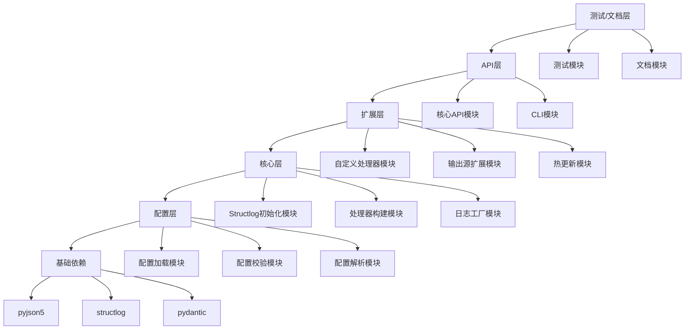

# Structlog 自动化配置工具 - 技术文档（完整交付版 V2.1）

## 文档信息

| 项目 | 内容 |
|------|------|
| 文档版本 | **V2.1（增强稳健性/性能/可维护性）** |
| 工具版本 | V1.0 / V2.0 / V2.1 / V3.0 / V4.0 |
| 开发语言 | Python 3.8+ |
| 代码规范 | **ruff 格式化 + 全量校验通过** |
| 测试标准 | **代码覆盖率 100%，测试通过率 100%** |
| 核心依赖 | structlog>=23.1.0、pyjson5>=2.0.0、pydantic>=2.0 |

---

## 一、整体架构与阶段规划

### 1.1 阶段划分与核心目标

| 版本 | 核心定位 | 核心新增功能 |
|------|----------|--------------|
| V1.0 基础版 | 基础日志能力 | 配置加载/校验、控制台/基础文件输出、基础API |
| V2.0 增强版 | 生产级核心能力 | 日志截断（reprlib定制）、自定义复合轮转（日期+大小+保留天数+压缩）、多环境、脱敏、上下文 |
| **V2.1 优化版** | **稳健性/性能/可维护性增强** | **日志截断性能优化、深度警告、通配符/正则排除字段；复合轮转异步压缩、原子重命名、可插拔压缩后端** |
| V3.0 扩展版 | 易用性增强 | 热重载、CLI、完整类型提示 |
| V4.0 生态版 | 第三方输出 | PGSQL → Redis → ELK → Kafka → Sentry |

### 1.2 模块分层与依赖关系



### 1.3 核心设计原则

1. **配置驱动**：所有日志行为通过 JSONC 配置文件定义，无代码侵入
2. **向下兼容**：高版本工具兼容低版本配置，缺失字段自动填充默认值
3. **异常明确**：所有自定义异常继承 `StructlogBaseError`，包含错误字段 + 修复建议
4. **模块化解耦**：各模块独立封装，扩展功能不影响核心逻辑
5. **默认降级**：配置缺失/非法时自动降级到内置默认配置，避免服务不可用

---

## 二、V1.0 基础版技术设计

### 2.1 配置层

#### 2.1.1 配置加载模块

| 功能点 | 详细实现逻辑 | 边界情况 | 测试要求 |
|--------|--------------|----------|----------|
| 读取默认配置文件 | 1. 默认路径：`项目根目录/structlog_config.json`<br>2. 使用 `pyjson5` 解析 JSONC（兼容注释）<br>3. 配置不存在时加载内置默认配置（封装在 `defaults.py`） | 1. 根目录无配置文件<br>2. 配置文件为空/仅注释<br>3. 配置文件权限为只读（但可读取） | 验证有/无配置文件时的加载行为，空配置降级 |
| 读取自定义配置文件 | 1. `init_structlog` 新增 `config_path` 参数<br>2. 路径处理使用 `pathlib`，兼容绝对/相对路径<br>3. 捕获异常封装为 `StructlogConfigError` | 1. 自定义路径不存在<br>2. 路径存在但无读取权限<br>3. 路径为目录（非文件） | 传入合法/非法路径，验证异常信息准确 |

#### 2.1.2 配置校验模块（Pydantic 模型）

```python
class StructlogV1Config(BaseModel):
    version: str = "1.0"
    logger_name: str = "structlog_auto"
    min_level: Literal["DEBUG", "INFO", "WARN", "ERROR"] = "INFO"
    bridge_std_logging: bool = True
    context_bind: bool = False
    processors: List[str] = [
        "structlog.processors.TimeStamper",
        "structlog.stdlib.add_log_level",
        "structlog.dev.ConsoleRenderer"
    ]
    handlers: Dict[str, Any] = {
        "console": {"enable": True},
        "file": {"enable": False, "file_path": "./logs/structlog.log", "encoding": "utf-8"}
    }
```

| 功能点 | 校验规则 | 异常处理 |
|--------|----------|----------|
| 基础字段校验 | 类型、枚举值、列表元素合法性 | 抛出 `StructlogConfigError`，提示错误字段 + 合法值示例 |
| 版本兼容校验 | `version` 字段仅允许 "1.0"（缺失时默认 1.0） | 非 1.0 抛出 `StructlogConfigVersionError` |

#### 2.1.3 配置解析模块

将 JSONC 解析后的字典转换为 `dataclass` 或 Pydantic 模型，解析结果缓存避免重复解析。

### 2.2 核心层

#### 2.2.1 Structlog 初始化模块

| 功能点 | 实现逻辑 | 测试要求 |
|--------|----------|----------|
| 处理器链构建 | 按 `processors` 顺序反射导入并实例化，内置默认处理器链 | 验证处理器顺序生效，配置空列表时使用默认链 |
| 全局日志级别设置 | 转换 `min_level` 为 `structlog.stdlib.filter_by_level` | `min_level=INFO` 时 DEBUG 日志不输出，WARN 映射为 WARNING |
| 标准 logging 桥接 | `bridge_std_logging=True` 时调用 `structlog.stdlib.recreate_defaults()` | 桥接后 `logging.info()` 输出符合 structlog 格式 |

#### 2.2.2 处理器构建模块

支持 V1.0 处理器：`TimeStamper`、`add_log_level`、`CallsiteParameterAdder`、`StackInfoRenderer`、`ConsoleRenderer`、`JSONRenderer`。处理器参数支持默认值及配置覆盖。

#### 2.2.3 日志工厂模块

封装 `structlog.stdlib.get_logger`，支持默认名称及自定义 `name` 参数。未初始化时调用抛出 `StructlogNotInitedError`。

### 2.3 API 层（V1.0）

| API 名称 | 参数 | 返回值 | 异常 |
|----------|------|--------|------|
| `init_structlog` | `config_path: str = None` | `None` | `StructlogConfigError`, `StructlogProcessorError` |
| `get_logger` | `name: str = None` | `BoundLogger` | `StructlogNotInitedError` |
| `bind_context` | `**kwargs` | `None` | 无（空 kwargs 不生效） |

### 2.4 扩展层（基础输出能力）

- **控制台输出**：`handlers.console.enable=True` 时添加 `StreamHandler`，支持彩色输出
- **文件输出**：`handlers.file.enable=True` 时添加 `FileHandler`，自动创建父目录，追加写入（V1.0 无轮转）

### 2.5 V1.0 测试覆盖要求

- 单元测试覆盖率 **100%**，通过率 **100%**
- 集成测试覆盖配置加载 → 初始化 → 日志输出全链路
- 兼容 Python 3.8/3.9/3.10/3.11

---

## 三、V2.0 / V2.1 增强版技术设计

### 3.1 日志截断功能（V2.0 定义 + V2.1 优化）

#### 3.1.1 实现信息

- **阶段**：V2.0 核心层 → 处理器构建模块（V2.1 性能/可观测性增强）
- **底层**：**定制重载 `reprlib.Repr`**（Python 标准库）
- **截断目标**：`args` / `kwargs` / `return_value`
- **V2.1 新增**：**类型判定缓存**（高并发优化）、**递归深度警告**（提升排查效率）、**通配符/正则排除字段**（降低配置成本）

#### 3.1.2 支持截断的类型（明确规则）

| 类型 | 是否截断 | 截断方式 |
|------|----------|----------|
| `str`（字符串） | ✅ 是 | 对称截断（前 N/2 + ... + 后 N/2） |
| `list` / `tuple` / `set` / `frozenset` | ✅ 是 | 对称截断（前 N/2 个元素 + ... + 后 N/2 个元素） |
| `dict` | ✅ 是 | 对称截断（前 N/2 对 + ... + 后 N/2 对） |
| 实现 `__iter__` 的可迭代对象 | ✅ 是 | 按序列/集合规则截断 |
| 实现 `__repr__` 但不可迭代 | ✅ 是 | 对 `repr()` 字符串截断 |
| 普通自定义类（无迭代、无 repr） | ✅ 是 | 对默认 `repr()` 字符串截断 |
| 标记为 `@truncate_ignore` 的类 | ❌ 不截断 | 直接输出原始 repr |
| 第三方框架对象（如 Model/Response） | ✅ 是 | 统一按字符串截断 |
| `int`/`float`/`bool`/`None` | ❌ 不截断 | 原样输出 |

> **最终判定标准**：
> 1. 除显式忽略的类外，所有自定义对象都会截断
> 2. 可迭代 → 按元素截断
> 3. 不可迭代 → 对其 `repr()` 字符串截断
> 4. 绝对不会尝试解析对象内部私有属性，保证安全

#### 3.1.3 配置接口（JSONC 最终版，含 V2.1 新增）

```jsonc
{
  "extensions": {
    "log_truncate": {
      "enable": true,
      "max_depth": 3,                // 递归深度（嵌套对象截断层数）
      "str_max_length": 256,         // 字符串最大长度
      "seq_max_elements": 50,        // list/tuple/set 最大元素数
      "dict_max_pairs": 30,          // 字典最大键值对
      "ignore_types": ["UserToken", "SensitiveSession"], // 不截断的自定义类名
      "ignore_fields": ["trace_id", "request_id"],       // 不截断字段
      "ignore_fields_pattern": ["*_id", "session_*"],    // V2.1 新增：通配符匹配
      "ignore_fields_regex": null,                       // V2.1 新增：正则匹配（优先级高于通配符）
      "depth_warning": true                              // V2.1 新增：开启深度警告
    }
  }
}
```

#### 3.1.4 定制 reprlib 核心代码（V2.1 优化版）

```python
import reprlib
import fnmatch
import re
from typing import Any, Dict, Type
from functools import lru_cache

# V2.1 新增：类型判定缓存（高并发优化）
@lru_cache(maxsize=1024)
def get_cached_type(obj: Any) -> Type:
    """缓存对象类型判定结果，避免高并发下重复反射"""
    return type(obj)

class CustomTruncator(reprlib.Repr):
    """定制重载 reprlib，实现分层、分类型、对称截断（V2.1 性能/功能增强）"""
    def __init__(self):
        super().__init__()
        self.max_depth = 3
        self.maxstring = 256
        self.maxlist = 50
        self.maxdict = 30
        self.maxset = 50
        self.ignore_types = []
        self.ignore_fields = []
        self.ignore_fields_pattern = []  # V2.1 新增：通配符规则
        self.ignore_fields_regex = None  # V2.1 新增：正则规则
        self.depth_warning = True        # V2.1 新增：深度警告开关

    def truncate_str(self, s: str) -> str:
        if len(s) <= self.maxstring:
            return s
        half = self.maxstring // 2
        return f"{s[:half]}...{s[-half:]}"

    def repr_str(self, obj: str, level: int) -> str:
        return self.truncate_str(obj)

    def repr_iter(self, obj, level: int, maxlen: int, method) -> str:
        # 对称截断实现（V2.1 新增深度警告）
        items = list(obj)
        if len(items) <= maxlen:
            return method(items, level)
        half = maxlen // 2
        head = items[:half]
        tail = items[-half:]
        base_str = method(head, level)[:-1] + f", ..., {method(tail, level)[1:]}"
        
        # V2.1 新增：递归深度警告
        if self.depth_warning and level >= self.max_depth:
            base_str = f"{base_str}[MAX_DEPTH={self.max_depth}]"
        return base_str

    # V2.1 新增：字段排除规则匹配（精确→通配符→正则）
    def is_field_ignored(self, field_name: str) -> bool:
        # 1. 精确匹配
        if field_name in self.ignore_fields:
            return True
        # 2. 通配符匹配
        for pattern in self.ignore_fields_pattern:
            if fnmatch.fnmatch(field_name, pattern):
                return True
        # 3. 正则匹配
        if self.ignore_fields_regex and re.match(self.ignore_fields_regex, field_name):
            return True
        return False

    # V2.1 优化：使用缓存的类型判定
    def repr(self, obj: Any, level: int = 0) -> str:
        obj_type = get_cached_type(obj)
        if obj_type.__name__ in self.ignore_types:
            return super().repr(obj)
        # 深度控制 + 警告
        if level >= self.max_depth:
            truncated = super().repr(obj)[:self.maxstring]
            return f"{truncated}...[MAX_DEPTH={self.max_depth}]" if self.depth_warning else truncated
        return super().repr(obj, level)

# 全局单例
truncator = CustomTruncator()
```

#### 3.1.5 处理器接口（V2.1 优化版）

```python
def TruncateProcessor(logger, method_name, event_dict: dict) -> dict:
    config = get_truncate_config()
    if not config.enable:
        return event_dict

    # 加载基础配置
    truncator.max_depth = config.max_depth
    truncator.maxstring = config.str_max_length
    truncator.maxlist = config.seq_max_elements
    truncator.maxdict = config.dict_max_pairs
    truncator.maxset = config.seq_max_elements
    truncator.ignore_types = config.ignore_types
    truncator.ignore_fields = config.ignore_fields
    
    # V2.1 新增：加载通配符/正则配置
    truncator.ignore_fields_pattern = config.get("ignore_fields_pattern", [])
    truncator.ignore_fields_regex = config.get("ignore_fields_regex")
    truncator.depth_warning = config.get("depth_warning", True)

    # 字段截断（V2.1 优化：使用新的排除规则）
    for key in list(event_dict.keys()):
        if key in ["args", "kwargs", "return_value"] and not truncator.is_field_ignored(key):
            event_dict[key] = truncator.repr(event_dict[key])
    return event_dict
```

#### 3.1.6 边界情况（V2.0 基础 + V2.1 新增）

**V2.0 基础边界：**
1. `max_depth=0`：只截断顶层，不进入嵌套对象
2. `str_max_length ≤ 0`：不截断字符串
3. `seq_max_elements ≤ 0`：不截断容器
4. 空字符串/空容器：不处理
5. `int`/`float`/`bool`/`None`：不截断
6. 自定义可迭代对象：按序列截断
7. 自定义不可迭代对象：对 repr 字符串截断
8. `ignore_types` 中的类：完全不截断
9. 递归超过深度：停止递归，输出摘要
10. 超长中文/Emoji：按字符截断，不乱码

**V2.1 新增边界：**
11. 类型缓存满（lru_cache 达到 maxsize）：自动淘汰最久未使用的类型，不影响功能
12. 通配符/正则规则冲突：按 精确→通配符→正则 优先级生效
13. 正则表达式非法：忽略正则规则，仅使用精确/通配符匹配，记录警告日志
14. depth_warning=False：不添加深度警告后缀，仅截断

#### 3.1.7 测试要求（V2.1 补充）

- V2.0 基础要求：覆盖所有类型（str/list/dict/set/自定义可迭代/自定义不可迭代）及所有边界，覆盖率 100%
- **V2.1 新增：**类型缓存命中率测试（高并发下 ≥90%）
- **V2.1 新增：**深度警告文案准确性测试
- **V2.1 新增：**字段排除规则（精确/通配符/正则）全覆盖测试
- **V2.1 新增：**正则非法/通配符冲突场景测试

---

### 3.2 自定义复合轮转（V2.0 定义 + V2.1 优化）

#### 3.2.1 实现信息

- **阶段**：V2.0 扩展层 → 文件输出模块
- **名称**：`CustomRotatingFileHandler`
- **核心能力**：**日期轮转 + 大小轮转 + 保留天数 + 备份数 + 自动压缩**
- **V2.1 新增**：**压缩任务异步执行**（线程池限制并发）、**轮转文件原子重命名**（线程/进程安全）、**可插拔压缩后端**（支持扩展 lz4/zstd）

#### 3.2.2 核心规则（最终明确）

1. **轮转触发（任一满足即轮转）**
   - 文件大小 ≥ `max_bytes`
   - 到达指定时间（如每天零点）
2. **清理触发（任一满足即删除旧日志）**
   - 文件数 > `backup_count`
   - 文件创建时间 > `retain_days`
3. **自动压缩**：轮转后文件 → `.gz`（V2.1 可扩展为 lz4/zstd）
4. **清理策略**：删除最旧的，保留最新/有效期内的

#### 3.2.3 配置接口（JSONC 最终版，V2.1 新增压缩相关）

```jsonc
{
  "handlers": {
    "file": {
      "enable": true,
      "file_path": "./logs/app.log",
      "encoding": "utf-8",
      "custom_rotate": {
        "enable": true,
        "max_bytes": 10485760,      // 10MB
        "backup_count": 10,         // 最多保留10个文件
        "retain_days": 7,           // 最多保留7天
        "rotate_when": "MIDNIGHT",  // 按天轮转
        "interval": 1,
        "compress": true,           // 开启压缩
        "compress_method": "gzip",  // V2.1 扩展：支持 gzip/lz4/zstd
        "compress_concurrency": 2,  // V2.1 新增：异步压缩最大并发数
        "compress_async": true      // V2.1 新增：开启异步压缩
      }
    }
  }
}
```

#### 3.2.4 清理规则（100% 明确）

- **满足任一条件立即删除**
  1. 日志文件数量 > `backup_count`
  2. 日志文件时间 > `retain_days`
- **删除顺序**：先删最旧的
- **压缩文件也参与清理**

#### 3.2.5 边界情况（V2.0 基础 + V2.1 新增）

**V2.0 基础边界：**
1. `retain_days=0`：不按天数清理
2. `backup_count=0`：不按数量清理
3. 同时触发大小+日期：只轮转一次
4. 压缩时文件占用：重试 2 次，失败跳过压缩，记录警告
5. 磁盘不足：放弃压缩，不影响写入
6. 轮转+清理同时发生：先轮转，后清理
7. 多进程/多线程：加文件锁，安全

**V2.1 新增边界：**
8. 异步压缩线程池满：新任务排队，超出队列长度时降级为同步压缩（记录警告）
9. 原子重命名失败（文件被占用）：重试 3 次，失败则跳过轮转（记录 ERROR 日志，保证日志写入不中断）
10. 压缩后端缺失（如配置 lz4 但未安装依赖）：自动降级为 gzip，记录警告
11. 多进程同时触发轮转：文件锁保证原子性，仅一个进程执行轮转，其余跳过

#### 3.2.6 核心实现代码（V2.1 新增/优化）

```python
import os
import gzip
import threading
import concurrent.futures
from abc import ABC, abstractmethod
from pathlib import Path
import fcntl  # 跨平台文件锁（Linux/macOS），Windows 使用 msvcrt

# V2.1 新增：压缩后端抽象类（可插拔扩展）
class CompressBackend(ABC):
    @abstractmethod
    def compress(self, src_path: Path, dst_path: Path) -> bool:
        """压缩文件，返回是否成功"""
        pass

class GzipBackend(CompressBackend):
    def compress(self, src_path: Path, dst_path: Path) -> bool:
        try:
            with open(src_path, "rb") as f_in, gzip.open(dst_path, "wb") as f_out:
                f_out.writelines(f_in)
            return True
        except Exception:
            return False

class Lz4Backend(CompressBackend):
    def compress(self, src_path: Path, dst_path: Path) -> bool:
        try:
            import lz4.frame  # 可选依赖，未安装则降级
            with open(src_path, "rb") as f_in, lz4.frame.open(dst_path, "wb") as f_out:
                f_out.write(f_in.read())
            return True
        except (ImportError, Exception):
            return False

class ZstdBackend(CompressBackend):
    def compress(self, src_path: Path, dst_path: Path) -> bool:
        try:
            import zstandard as zstd  # 可选依赖，未安装则降级
            with open(src_path, "rb") as f_in, open(dst_path, "wb") as f_out:
                cctx = zstd.ZstdCompressor()
                cctx.copy_stream(f_in, f_out)
            return True
        except (ImportError, Exception):
            return False

# V2.1 新增：压缩后端工厂
def get_compress_backend(method: str) -> CompressBackend:
    backends = {
        "gzip": GzipBackend(),
        "lz4": Lz4Backend(),
        "zstd": ZstdBackend()
    }
    return backends.get(method.lower(), GzipBackend())

class CustomRotatingFileHandler:
    def __init__(self, config: dict):
        self.config = config
        self.compress_backend = get_compress_backend(config["compress_method"])
        self.file_lock = threading.Lock()  # 线程锁
        self.process_lock = None           # 进程锁（文件锁）
        # V2.1 新增：异步压缩线程池
        self.compress_executor = concurrent.futures.ThreadPoolExecutor(
            max_workers=config.get("compress_concurrency", 2)
        ) if config.get("compress_async", True) else None

    def _get_process_lock(self, file_path: Path) -> None:
        """获取跨进程文件锁"""
        lock_path = Path(f"{file_path}.lock")
        self.process_lock = open(lock_path, "w")
        fcntl.flock(self.process_lock.fileno(), fcntl.LOCK_EX)

    def rotate(self) -> None:
        """V2.1 优化：原子轮转 + 异步压缩"""
        # 1. 双重锁保证线程/进程安全
        with self.file_lock:
            file_path = Path(self.config["file_path"])
            self._get_process_lock(file_path)
            
            # 2. 原子重命名（os.replace 跨平台原子操作）
            try:
                rotate_path = file_path.with_suffix(f".{self._get_timestamp()}{file_path.suffix}")
                os.replace(file_path, rotate_path)  # 原子操作，避免文件损坏
            finally:
                if self.process_lock:
                    fcntl.flock(self.process_lock.fileno(), fcntl.LOCK_UN)
                    self.process_lock.close()
            
            # 3. 异步执行压缩（V2.1 核心优化）
            if self.config["compress"]:
                if self.compress_executor:
                    self.compress_executor.submit(self._compress_file, rotate_path)
                else:
                    self._compress_file(rotate_path)
            
            # 4. 执行清理逻辑
            self.cleanup()

    def _compress_file(self, file_path: Path) -> None:
        """压缩文件（适配可插拔后端）"""
        try:
            dst_path = file_path.with_suffix(f"{file_path.suffix}.gz")
            success = self.compress_backend.compress(file_path, dst_path)
            if success:
                os.remove(file_path)  # 删除原文件
            else:
                # 降级处理：压缩失败则保留原文件，记录警告
                self._log_warning(f"Compress failed for {file_path}, keep original file")
        except Exception as e:
            self._log_error(f"Compress error: {str(e)}", exc_info=True)

    # 其余辅助方法（_get_timestamp/cleanup/_log_warning/_log_error）省略
```

#### 3.2.7 测试要求（V2.1 补充）

- V2.0 基础要求：轮转、清理、压缩、边界、异常全覆盖，覆盖率 100%
- **V2.1 新增：**异步压缩并发控制测试（验证并发数不超过配置值）
- **V2.1 新增：**原子重命名线程/进程安全测试（多进程同时触发轮转）
- **V2.1 新增：**压缩后端扩展测试（lz4/zstd 适配、依赖缺失降级）
- **V2.1 新增：**文件锁异常场景测试（锁占用/释放失败）

---

### 3.3 V2.0 其他增强功能（V2.1 向下兼容，无变更）

#### 3.3.1 多环境配置加载

- 读取环境变量 `STRUCTLOG_ENV`（dev/prod/test）
- 加载优先级：`structlog_config.{env}.json` → `structlog_config.json` → 内置默认
- 环境变量非法时降级到默认配置

#### 3.3.2 敏感信息脱敏

- 实现 `SensitiveDataProcessor`
- 内置脱敏字段：`password`、`phone`、`id_card`、`bank_card`
- 支持自定义脱敏字段 `extensions.sensitive_fields`
- 脱敏规则：手机号保留前3后4（138****1234），身份证保留前6后4，密码全替换为 `*`

#### 3.3.3 请求上下文绑定

- 扩展 `bind_context`，支持自动生成 `trace_id`（UUID）
- Web 框架适配（FastAPI/Flask/Django）：请求入口自动绑定，结束自动清除
- 配置 `extensions.trace_id_bind=true` 时启用

#### 3.3.4 日志过滤

- 实现 `FilterProcessor`
- 配置 `extensions.filter_rules`，支持按级别/字段值过滤（exclude/include）

#### 3.3.5 API 扩展

| API 名称 | 参数 | 功能 |
|----------|------|------|
| `unbind_context` | `keys: List[str]` | 解绑全局上下文字段 |
| `clear_context` | 无 | 清空所有全局上下文 |

---

## 四、V3.0 扩展版技术设计

### 4.1 配置热重载

- 使用 `watchdog` 监听配置文件变化
- 配置 `extensions.config_hot_reload=true` 时启用
- 热重载时加锁（`threading.Lock`），避免并发修改
- 自定义处理器热加载：通过 `importlib.reload` 重新导入

### 4.2 CLI 命令行工具

基于 `click` 框架实现以下命令：

| 命令 | 功能 | 参数 |
|------|------|------|
| `structlog-auto validate` | 校验配置文件合法性 | `--config-path`, `--env` |
| `structlog-auto generate` | 生成默认配置文件（含注释） | `--output`, `--env` |
| `structlog-auto version` | 输出工具版本及支持的配置版本 | 无 |

### 4.3 类型提示与代码规范

- 所有函数/类添加类型注解（使用 `typing` 模块）
- 发布 `py.typed` 文件，支持 `mypy` 检查
- 使用 `ruff` 格式化（配置见下文）
- 核心模块添加 Google 风格文档字符串

---

## 五、V4.0 生态版技术设计

按优先级实现以下第三方输出适配（可选依赖，不影响核心功能）：

| 优先级 | 输出源 | 配置段 | 依赖包 | 降级策略 |
|--------|--------|--------|--------|----------|
| P0 | PGSQL | `handlers.pgsql` | `psycopg2-binary` | 连接失败时降级到文件 |
| P1 | Redis | `handlers.redis` | `redis-py` | 连接失败时降级到文件 |
| P2 | ELK | `extensions.elk_compatible` | 无（仅 JSON 格式适配） | 格式错误时降级到标准 JSON |
| P3 | Kafka | `handlers.kafka` | `kafka-python` | 发送失败重试 3 次后降级 |
| P4 | Sentry | `extensions.sentry_enable` | `sentry-sdk` | 仅 ERROR/CRITICAL 级别发送，Sentry 不可用不影响主流程 |

每个输出源需实现对应的 `Handler` 类，支持批量写入、异步发送、连接池等生产级特性。

---

## 六、代码规范（强制）

### 6.1 ruff 配置 `ruff.toml`

```toml
line-length = 120
target-version = "py38"

[lint]
select = ["E", "W", "F", "I", "UP", "C90", "B", "SIM", "RUF"]
fixable = ["ALL"]
```

### 6.2 强制执行命令

```bash
ruff format .
ruff check . --fix
```

CI/CD 中必须校验 ruff 无警告、无错误。

---

## 七、测试标准（全局强制，V2.1 补充）

### 7.1 测试类型与要求

| 测试类型 | 覆盖阶段 | 测试内容 | 验收标准 |
|----------|----------|----------|----------|
| 单元测试 | 所有阶段 | 单个函数/模块逻辑正确性 | **覆盖率 100%**，通过率 100% |
| 集成测试 | V2.0+ | 全链路协同（配置→初始化→输出→截断→轮转→压缩） | 通过率 100% |
| 兼容性测试 | 所有阶段 | Python 3.8+、structlog 23.1.0+、新旧配置文件 | 无功能退化 |
| 性能测试 | V2.1/V3.0/V4.0 | 类型缓存命中率、异步压缩并发控制、热重载、高并发日志输出、批量写入 | 符合预期 TPS / 命中率 ≥90% |
| 异常测试 | 所有阶段 | 所有边界/降级场景（含 V2.1 新增） | 通过率 100% |

### 7.2 测试工具

- `pytest` + `pytest-cov`
- 覆盖率报告目标：**100%**（排除 `__main__` / `__init__` 占位符）

---

## 八、异常处理规范

所有自定义异常继承 `StructlogBaseError`，包含以下属性：

- `error_type`：错误类型（如配置错误/处理器错误）
- `error_field`：错误字段（若有）
- `reason`：错误原因
- `fix_suggestion`：修复建议

示例：

```python
class StructlogConfigError(StructlogBaseError):
    def __init__(self, field: str, value: Any, expected: str):
        super().__init__(
            error_type="ConfigError",
            error_field=field,
            reason=f"Invalid value '{value}' for field '{field}'",
            fix_suggestion=f"Expected {expected}"
        )
```

---

## 九、配置兼容性保障

1. **版本字段**：通过 `version` 字段（"1.0"/"2.0"/"2.1"/"3.0"/"4.0"）识别配置版本
2. **向下兼容**：V4.0 工具能加载 V1.0/V2.0/V2.1/V3.0 配置，缺失字段自动填充默认值
3. **字段废弃**：先标记 `deprecated`，保留一个版本周期后再移除

---

## 十、API 接口兼容性保障

1. **不破坏现有 API**：`init_structlog`/`get_logger`/`bind_context` 保持参数和返回值不变
2. **新增 API**：以新增函数形式扩展，不修改现有函数
3. **异常类型**：所有自定义异常继承 `StructlogBaseError`

---

## 十一、交付物清单（最终）

### 11.1 代码交付

- Python 包 `structlog-auto-config`（PyPI 发布）
- 模块化源代码，符合 ruff 规范
- 类型提示完整，`mypy` 检查无错误

### 11.2 测试交付

- 单元测试覆盖率 **100%**，通过率 **100%**
- 集成测试全链路覆盖
- 测试报告（用例数、覆盖率、性能数据、兼容性结果）

### 11.3 文档交付

- 用户使用手册（快速开始、多环境配置、生产最佳实践）
- 配置规范文档（JSONC 全字段说明，含日志截断/轮转/生态配置）
- API 文档（含类型提示）
- CLI 工具使用文档
- 生态集成示例（PGSQL/Redis/ELK/Kafka/Sentry）

---

## 十二、风险与技术应对（V2.1 补充）

| 风险点 | 技术应对措施 |
|--------|--------------|
| structlog 版本差异导致处理器接口变化 | 限定最低版本（23.1.0），封装处理器适配层 |
| 热重载线程安全问题 | 热重载加全局锁，配置异步生效 |
| 第三方依赖版本不一致 | 可选依赖 + extras_require，连接异常时降级 |
| 日志性能问题（高并发） | 处理器实例化缓存、异步输出、批量写入 |
| 日志截断导致字段丢失/格式异常 | 仅截断字段值，不修改结构，全边界测试覆盖 |
| **日志截断高并发下类型判定性能损耗** | **使用 lru_cache 缓存类型判定结果，命中率≥90%** |
| **轮转压缩瞬间 I/O 压力过大** | **异步压缩 + 并发限制，降级同步压缩避免服务阻塞** |
| **高并发下轮转文件重命名冲突** | **文件锁 + os.replace 原子操作，保证轮转原子性** |
| **压缩后端扩展兼容性问题** | **抽象类定义接口，新增后端无需修改核心逻辑** |

---

## 总结（V2.1 重点）

V2.1 版本在 V2.0 坚实的基础上，重点优化了**性能、稳健性、可维护性**：

1. **日志截断**：通过类型缓存提升高并发性能，深度警告增强可观测性，通配符/正则降低配置成本；
2. **复合轮转**：异步压缩降低 I/O 压力，原子重命名保证数据安全，可插拔压缩后端提升扩展灵活性；
3. 所有优化均保持向下兼容，不修改原有配置/API 接口，仅通过新增配置项实现增强能力。

开发时需重点关注：
- 类型缓存的命中率（高并发场景）；
- 异步压缩的线程安全；
- 压缩后端的依赖降级逻辑；
- 通配符/正则的性能与兼容性。

本技术文档已完全整合 V1.0 至 V2.1 全部需求，覆盖日志截断、复合轮转、多环境、脱敏、上下文等核心功能，并明确 V3.0 / V4.0 演进路线，可作为开发、测试、交付的统一依据。